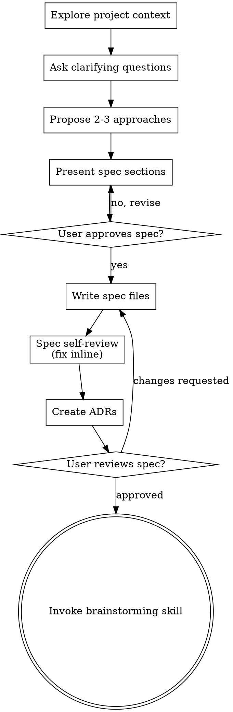

# Bootstrapping a New Project

Define the initial project spec and architecture. Once the foundation is laid, earmark the first chunk of work via brainstorming.

Start by understanding the user's vision, then ask questions one at a time to shape the project. Once you understand what's being built, present the spec design and get user approval.

<HARD-GATE>
Do NOT invoke any implementation skill, write any code, scaffold any project, or take any implementation action until you have presented a spec design and the user has approved it.
</HARD-GATE>

## Doc Layout

```
docs/
  spec/                         # Living project description (how the project SHOULD be)
    architecture.md             # High-level architecture
    data-model.md               # Core entities, relationships, invariants
    ...                         # Additional spec files as needed

  changes/                      # Per-change artifacts (timestamped)
    YYYY-MM-DD-<topic>-requirement.md
    YYYY-MM-DD-<topic>-plan.md

  adr/                          # Hard-to-reverse architectural decisions
```

Bootstrapping creates `docs/spec/` and initial `docs/adr/` entries. The `docs/changes/` directory is populated later by brainstorming and writing-plans.

## Checklist

You MUST create a task for each of these items and complete them in order:

1. **Explore project context** — check files, git, existing docs (likely empty for new projects)
2. **Ask clarifying questions** — one at a time, understand purpose/constraints/success criteria
3. **Propose 2-3 approaches** — for the overall architecture, with trade-offs and your recommendation
4. **Present spec design** — in sections scaled to their complexity, get user approval after each section
5. **Write spec files** — save to `docs/spec/` (one per logical domain) and commit
6. **Spec self-review** — check for placeholders, contradictions, ambiguity (see below)
7. **Create ADRs** — for key architectural decisions surfaced during bootstrapping
8. **User reviews spec** — ask user to review the spec files before proceeding
9. **Transition to first change** — invoke brainstorming skill to earmark the first piece of work

## Process Flow



**The terminal state is invoking brainstorming.** Do NOT invoke writing-plans or any implementation skill. brainstorming is the next step — it earmarks the first chunk of work from the spec.

## The Process

**Understanding the vision:**

- For a new project, explore existing files, git state, and any code already present
- Ask questions one at a time to shape the project
- Prefer multiple choice questions when possible, but open-ended is fine too
- Only one question per message — if a topic needs more exploration, break it into multiple questions
- Focus on understanding: purpose, target users, constraints, success criteria
- Before asking detailed questions, assess scope: if the vision covers multiple independent subsystems, flag this and help decompose into logical spec files

**Exploring approaches:**

- Propose 2-3 different architectural approaches with trade-offs
- Present options conversationally with your recommendation and reasoning
- Lead with your recommended option and explain why

**Presenting the spec:**

- Once you believe you understand the project, present the spec design
- Scale each section to its complexity: a few sentences if straightforward, up to 200-300 words if nuanced
- Ask after each section whether it looks right so far
- Cover: high-level architecture, core data model, component boundaries, key invariants
- Be ready to go back and clarify

**Design for isolation and clarity:**

- Break the system into smaller units that each have one clear purpose, communicate through well-defined interfaces
- For each unit, you should be able to answer: what does it do, how do you use it, and what does it depend on?
- Can someone understand what a unit does without reading its internals? Can you change the internals without breaking consumers?

## After the Spec

### Spec Files

Write the validated spec to `docs/spec/`. Split by logical domain, not by document size:

- `docs/spec/architecture.md` — high-level component architecture, boundaries, data flow
- `docs/spec/data-model.md` — core entities, relationships, invariants, state management
- Additional files as the project warrants (e.g., `docs/spec/api.md`, `docs/spec/security.md`)
- One file per logical concern — don't dump everything into one file, don't split into tiny fragments

Commit the spec files to git.

**Self-Review:**
After writing, check with fresh eyes:

1. **Placeholder scan:** Any "TBD", "TODO", incomplete sections, or vague requirements? Fix them.
2. **Internal consistency:** Do any spec files contradict each other? Does the architecture match the data model?
3. **Scope check:** Is this focused enough for a bootstrapped foundation, or does it need decomposition?
4. **Ambiguity check:** Could any requirement be interpreted two different ways? If so, pick one and make it explicit.

Fix any issues inline and move on.

### ADRs

For architecturally significant decisions surfaced during bootstrapping, use the `adr` skill to record them now. This is part of the spec phase, not deferred to later.

### User Review Gate

After self-review and ADRs pass:

> "Spec written to `docs/spec/`. Please review the files and let me know if you want to make any changes before we earmark the first piece of work."

Wait for approval. If changes requested, make them and re-run self-review.

### Transition to First Change

- Invoke the **brainstorming** skill to earmark the first chunk of work from the spec
- Do NOT invoke writing-plans or any implementation skill. brainstorming is next.

## Key Principles

- **One question at a time** — Don't overwhelm with multiple questions
- **Multiple choice preferred** — Easier to answer than open-ended when possible
- **YAGNI ruthlessly** — Remove unnecessary features from the spec
- **Explore alternatives** — Always propose 2-3 approaches before settling
- **Incremental validation** — Present spec, get approval before moving on
- **Be flexible** — Go back and clarify when something doesn't make sense
- **Spec files = living docs** — They describe where the project SHOULD be, updated as the project evolves
