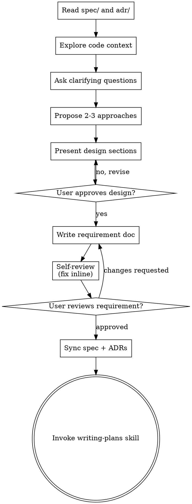

# Brainstorming Changes

Define a unit of change by consulting the project spec and ADRs, then produce a requirements document that scopes what to build.

Start by reading `docs/spec/` and `docs/adr/` to understand the project's current intended state. Then ask questions one at a time to refine the change. Once you understand what you're building, present the design and get user approval.

<HARD-GATE>
Do NOT invoke any implementation skill, write any code, scaffold any project, or take any implementation action until you have presented a design and the user has approved it. This applies to EVERY project regardless of perceived simplicity.
</HARD-GATE>

## Doc Layout

```
docs/
  spec/                         # Living project description (how the project SHOULD be)
    architecture.md             # Read these for context
    data-model.md               # before brainstorming
    ...

  changes/                      # Per-change artifacts (timestamped)
    YYYY-MM-DD-<topic>-requirement.md   # This skill's output
    YYYY-MM-DD-<topic>-plan.md        # writing-plans output

  adr/                          # Hard-to-reverse decisions (read these for context)
```

## Anti-Pattern: "This Is Too Simple To Need A Design"

Every change goes through this process. A single-function utility, a config change, a refactor — all of them. "Simple" changes are where unexamined assumptions cause the most wasted work. The design can be short (a few sentences for truly simple changes), but you MUST present it and get approval.

## Checklist

You MUST create a task for each of these items and complete them in order:

1. **Read project context** — read `docs/spec/` and `docs/adr/` to understand the project's intended state and past decisions
2. **Explore code context** — check files, docs, recent commits to understand the current implementation state
3. **Ask clarifying questions** — one at a time, understand purpose/constraints/success criteria for this change
4. **Propose 2-3 approaches** — with trade-offs and your recommendation
5. **Present design** — in sections scaled to their complexity, get user approval after each section
6. **Write requirement doc** — save to `docs/changes/YYYY-MM-DD-<topic>-requirement.md` and commit
7. **Requirement self-review** — check for placeholders, contradictions, ambiguity, scope (see below)
8. **User reviews requirement** — ask user to review the file before proceeding
9. **Sync project spec and ADRs** — update `docs/spec/` if this change alters the project's intended state; create ADRs for key decisions
10. **Transition to implementation** — invoke writing-plans skill to create implementation plan

## Process Flow



**The terminal state is invoking writing-plans.** Do NOT invoke any implementation skill. The ONLY skill you invoke after brainstorming is writing-plans.

## The Process

**Reading project context:**

- Read `docs/spec/` files first — these describe how the project SHOULD be
- Read `docs/adr/` for past architectural decisions that constrain this change
- Understand the gap between the spec's intended state and the current code, if any

**Understanding the change:**

- Check out the current project state (files, docs, recent commits)
- Before asking detailed questions, assess scope: if the request is too large for a single change, flag this and help decompose
  - The size of a single change should be the size of a good/clean pull request.
- Understand if the change is to bring the implementation up to date with the spec, or a new change to the spec
- Ask questions one at a time to refine the change
- Prefer multiple choice questions when possible, but open-ended is fine too
- Only one question per message — break complex topics into multiple questions
- Focus on understanding: purpose, constraints, success criteria

**Exploring approaches:**

- Propose 2-3 different approaches with trade-offs
- Present options conversationally with your recommendation and reasoning
- Lead with your recommended option and explain why

**Presenting the design:**

- Once you believe you understand what you're building, present the design
- Scale each section to its complexity: a few sentences if straightforward, up to 200-300 words if nuanced
- Ask after each section whether it looks right so far
- Cover: architecture, components, data flow, error handling, testing
- Be ready to go back and clarify if something doesn't make sense

**Design for isolation and clarity:**

- Break the system into smaller units that each have one clear purpose, communicate through well-defined interfaces, and can be understood and tested independently
- For each unit, you should be able to answer: what does it do, how do you use it, and what does it depend on?
- Smaller, well-bounded units are easier for you to work with — you reason better about code you can hold in context at once

**Working in existing codebases:**

- Explore the current structure before proposing changes. Follow existing patterns.
- Where existing code has problems that affect the work (e.g., a file that's grown too large, unclear boundaries), include targeted improvements as part of the design
- Don't propose unrelated refactoring. Stay focused on what serves the current goal.

## After the Design

Three document types serve different purposes:

- **Requirement doc** (`docs/changes/YYYY-MM-DD-<topic>-requirement.md`) — The *output* of a brainstorm session. Describes the requirements, approach, and scope for a specific change. This is what the implementation plan is built from.
- **Project spec** (`docs/spec/`) — The *living description* of how the project SHOULD be. Updated when a change alters the project's architecture, data model, API surface, or core behavior.
- **ADR** (`docs/adr/`) — Key architectural decisions that are hard to reverse. Use the `adr` skill to create them when a change surfaces trade-offs worth recording.

### 1. Requirement Doc

Write the primary output of this session:

- Save to `docs/changes/YYYY-MM-DD-<topic>-requirement.md`
  - (User preferences for location override this default)
- Reference which spec files this change relates to
- Commit the requirement doc to git

**Self-Review:**
After writing, check it with fresh eyes:

1. **Placeholder scan:** Any "TBD", "TODO", incomplete sections, or vague requirements? Fix them.
2. **Internal consistency:** Do any sections contradict each other? Does the architecture match the feature descriptions?
3. **Scope check:** Is this focused enough for a single implementation plan, or does it need decomposition?
4. **Ambiguity check:** Could any requirement be interpreted two different ways? If so, pick one and make it explicit.

Fix any issues inline and move on.

**User Review Gate:**
After self-review passes, ask:

> "Requirement doc written to `<path>`. Please review it and let me know if you want to make any changes before we sync the project spec and write the implementation plan."

Wait for approval. If changes requested, make them and re-run self-review.

### 2. Project Spec

Check whether the spec files in `docs/spec/` need updating:

- If this change alters the project's architecture, data model, API surface, or core behavior, the relevant spec files should reflect the *post-implementation* state.
- Reference the specific spec files that need changes.
- If the spec doesn't exist yet (no bootstrapping was done), offer to create `docs/spec/`.
- If the spec exists but doesn't need changes for this change, note that and move on.
- The spec describes the project as a whole, not just this change. Keep files concise.

### 3. ADRs

For decisions surfaced during brainstorming that are architecturally significant and hard to reverse, use the `adr` skill to record them. Do this now, before transitioning to implementation planning.

### Transition to Implementation

- Invoke the writing-plans skill to create a detailed implementation plan
- Do NOT invoke any other skill. writing-plans is the next step.

## Key Principles

- **Read spec first** — Understand the project's intended state before designing a change
- **One question at a time** — Don't overwhelm with multiple questions
- **Multiple choice preferred** — Easier to answer than open-ended when possible
- **YAGNI ruthlessly** — Remove unnecessary features from all designs
- **Explore alternatives** — Always propose 2-3 approaches before settling
- **Incremental validation** — Present design, get approval before moving on
- **Be flexible** — Go back and clarify when something doesn't make sense
